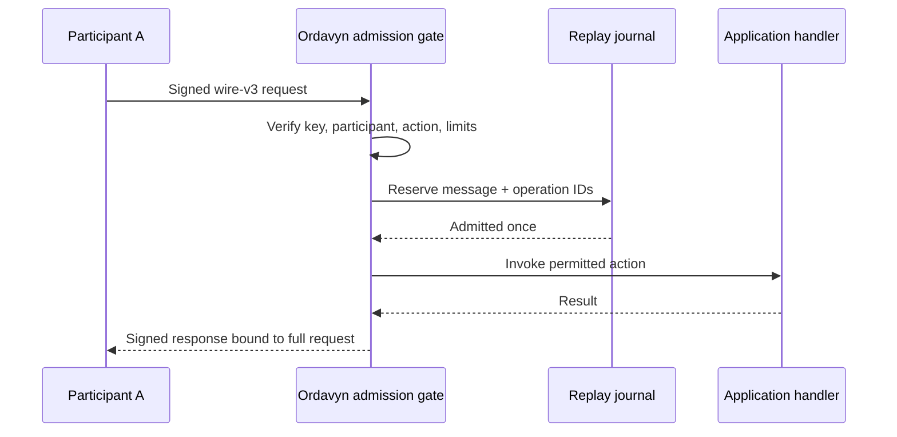

# Ordavyn

[](https://github.com/artemiosu/ordavyn/actions/workflows/ci.yml)
[](LICENSE)
[](docs/RELEASE-STATUS.md)

**A role-neutral protocol experiment for authenticated, replay-resistant exchange
between software participants.**

Ordavyn gives an agent or service a small, explicit boundary for accepting an
action: who signed it, which participant they represent, what they may invoke,
and whether the request or logical operation was already admitted. The current
Rust and Python implementations let technical reviewers exercise that boundary
locally today.

> **Maturity:** public experimental repository; loopback-only implementation.
> No package has been released to crates.io or PyPI. Ordavyn is not production
> ready or security audited. Ordavyn is not a standard. Start with the source
> demo below.

## Why Ordavyn

Software participants often need more than a transport connection: they need a
verifiable request author, explicit action-level permission, replay barriers, and
a response tied to the exact signed request. Ordavyn explores those properties in
a standalone protocol whose participants can be agents, services, or peers in
either direction.

The project is Native Architecture-First: the protocol and SDKs stand on their
own. Hosted or commercial services are optional and replaceable.

## How the exchange works



Every produced protocol response or error returned to the application is signed
and checked against a preconfigured responder key and participant. Malformed
transport input may instead receive an unsigned HTTP 400 transport error. A request
is reserved before its handler runs. An error after sending does not prove that an
external effect did not happen; applications must retain identifiers and reconcile
unknown outcomes.

## What works today

- Strict JSON wire v3 with deterministic CBOR signing and Ed25519 request and
  response authentication ([wire contract](docs/LOCAL-WIRE-V3.md)).
- Explicit key, participant, recipient, and action grants enforced before handler
  execution ([lifecycle guide](docs/LOCAL-LIFECYCLE.md)).
- Message and operation replay barriers using memory or explicitly provisioned
  SQLite journals ([journal guide](docs/LOCAL-JOURNAL.md)).
- Request-bound signed success and error responses with an out-of-band responder
  key pin ([wire binding contract](docs/LOCAL-WIRE-V3.md),
  [shared response tests](implementation/tests/test_authenticated_exchange.py)).
- Rust and Python implementations with shared vectors and
  [live cross-SDK tests](implementation/tests/test_interop.py).
- Optional TLS 1.3 with explicit CA and SAN checks; plain HTTP is an explicit
  loopback test mode without confidentiality.

The implemented profile is loopback-only HTTP/1.1. It has no automatic retries,
exactly-once external effects, discovery, delegation, negotiation, streaming,
post-quantum cryptography, or production deployment profile. Already admitted
handlers may finish after revocation or stop. Read the
[threat model](docs/LOCAL-THREAT-MODEL.md) before evaluating security properties.

Ordavyn is being explored as a focused protocol layer. It is not an implementation
of MCP, A2A, libp2p, or OpenTelemetry, and currently claims no compatibility with
them. Future integration belongs behind demonstrated interoperability and
conformance evidence.

## Quickstart from source

Requirements: Git, a POSIX shell, and Python 3.10 or newer. This sequence is
validated on Linux; the path syntax is also suitable for macOS but has not been
validated there. Windows requires equivalent environment and path commands, which
this quickstart does not provide. From a clean clone, create a fresh temporary
environment, install the Python SDK directly from the checkout, and run the
two-way role-neutral demo:

```sh
git clone https://github.com/artemiosu/ordavyn.git
cd ordavyn
ORDAVYN_VENV="$(mktemp -d "${TMPDIR:-/tmp}/ordavyn-quickstart.XXXXXX")"
python3 -m venv "$ORDAVYN_VENV"
"$ORDAVYN_VENV/bin/python" -m pip install ./implementation/python-sdk
"$ORDAVYN_VENV/bin/python" implementation/demo/demo_multi.py
```

Expected final line:

```text
Ordavyn two-way service exchange: both authorized requests succeeded
```

The demo uses ephemeral loopback ports, generates keys in memory, performs one
authorized request in each direction, and stops both servers. It uses no package
registry release, private input, credential, or real operation. See the
[tutorial](implementation/TUTORIAL.md) for local artifact builds and more demos.
This convenience install resolves currently compatible third-party dependencies;
it is not hermetic. The release evidence workflow uses pinned, hash-checked inputs.

## Documentation

- [Prepared protocol Draft 0.1](spec/README.md) — implementation-independent
  normative contract awaiting a release checkpoint.
- [Normative wire-v3 specification](spec/ORDAVYN-WIRE-V3.md) — envelope,
  canonicalization, admission, replay, result, transport, and limit rules.
- [Conformance evidence](spec/CONFORMANCE.md) — positive/negative selectors and
  the versioned unsupported inventory; not certification.
- [Implementation guide](implementation/README.md) — SDK layout, verification,
  and implemented limits.
- [Wire v3](docs/LOCAL-WIRE-V3.md) — envelope, signatures, response binding, and
  transport contract.
- [Threat model](docs/LOCAL-THREAT-MODEL.md) — protected boundaries and residual
  risks.
- [Persistent journal](docs/LOCAL-JOURNAL.md) — provisioning, recovery, and
  unknown outcomes.
- [Admission lifecycle](docs/LOCAL-LIFECYCLE.md) — grants, rotation, revocation,
  stop, and resume.
- [Release status](docs/RELEASE-STATUS.md) — public-repository status, package
  release limits, and remaining evidence gaps.
- [Third-party evidence](docs/THIRD-PARTY.md) — dependency inventory boundaries.

## Roadmap to an open standard

Ordavyn can become a credible standards proposal only through evidence: a stable
public specification, independent implementations, a reusable conformance suite,
demonstrated interoperability, independent security review, and open governance.
None of those outcomes is implied by this repository. The evidence gates and
their current state are in [ROADMAP.md](ROADMAP.md).

Current decisions use transparent [single-maintainer governance](GOVERNANCE.md).
[DCO 1.1](DCO.txt) applies prospectively after the documented baseline; older
history is not represented as signed off.

## Verify and contribute

The demo above needs only SDK runtime dependencies. For the smaller public
repository and guide checks below, install the pinned verification toolset into
the same venv, prepare the exact locked Rust inputs, then run the checks:

```sh
"$ORDAVYN_VENV/bin/python" -m pip install --require-hashes -r release/verification-requirements.txt
cargo +1.98.1 fetch --manifest-path implementation/Cargo.toml --locked --target x86_64-unknown-linux-gnu
cargo +1.98.1 build --manifest-path implementation/Cargo.toml --examples --locked --offline
"$ORDAVYN_VENV/bin/python" -m unittest discover -s tools/tests -v
"$ORDAVYN_VENV/bin/python" tools/verify_guides.py --root .
```

These are not the complete release-evidence suites. They also require Cargo and
the Rust 1.98.1 toolchain named in `implementation/rust-toolchain.toml`. See the
[complete verification procedure](release/README.md) for the pinned environment,
Python/Rust/interoperability suites, artifacts, and remaining limits.

Contribution expectations are in [CONTRIBUTING.md](CONTRIBUTING.md). Use the
structured issue forms for defects and proposals. Report sensitive findings through
the process in [SECURITY.md](SECURITY.md); no response SLA is promised.
